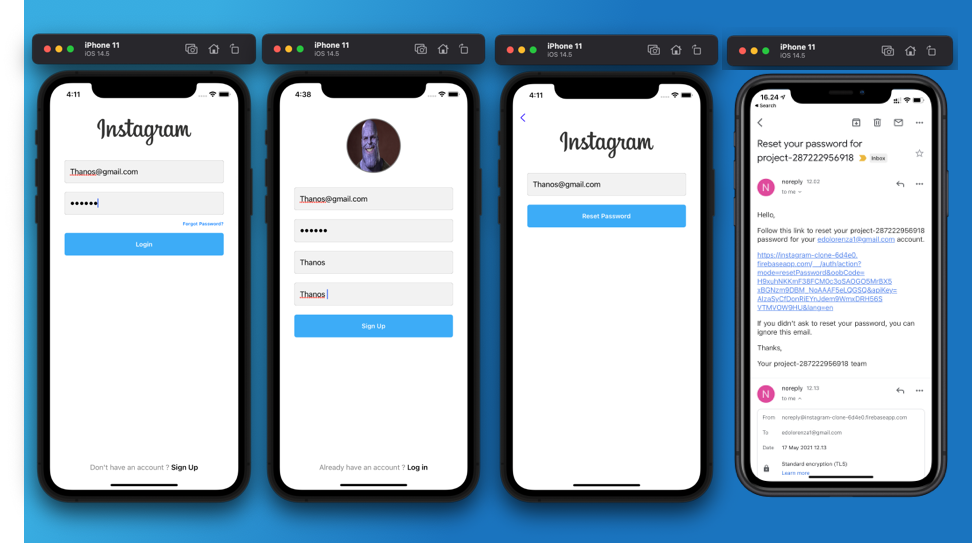
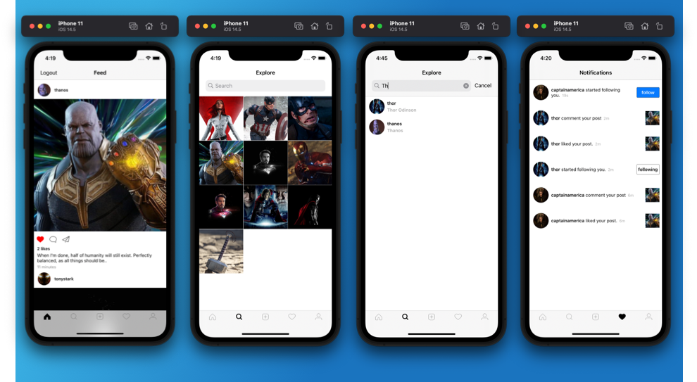
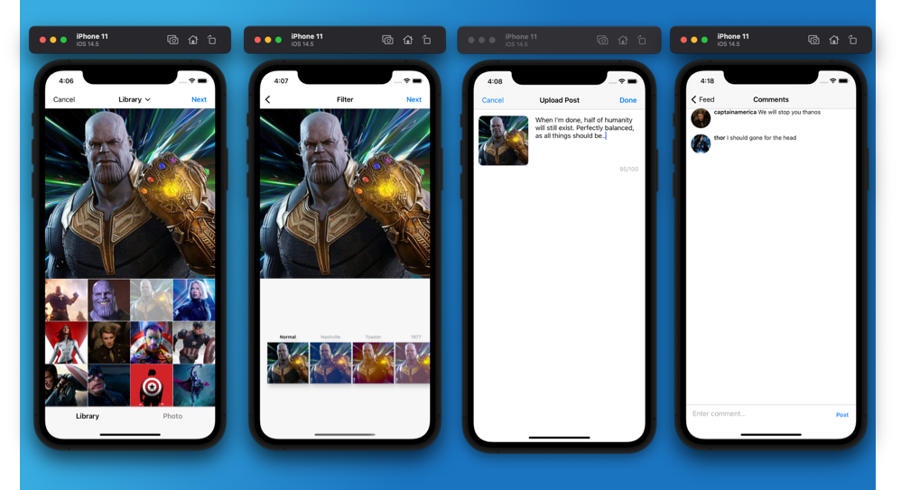

# Instagram clone 

## User Auth with Firebase
* Register, Login, Forget Password

## Feed
* Display posts from following users, give like & comment
* Search users using UISearchController
* Display owner post with collectionView
* Follow and Unfollow user

## Create Post
* Display post time on posts and notifications screen
* Pick image from library & give image a filter using YPImagePicker

## Objective
* UIKit Programmatically
* Backend server using Cloud Firestore
* Authenticate and register users with Firebase
* Upload post images to Firebase Storage
* Parse incoming JSON data from database
  
## Screenshot

